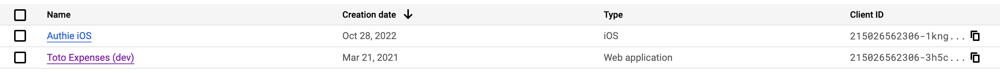

# Guide for Toto API Controller v10.0.0

## Changes in this version
Version 10.0.0 introduces a change in the configuration of authorized client IDs.<br>
Since Google (GCP) requires a client ID for every "device" or "application" that wants access to an API, the Config class must support this, hence the `getAuthorizedClientIDs()` method, will now provide an object for the key `google`.
So it will return
```
{
    "google": {
        "applicationABC": <string>, 
        "applicationXYZ": <string>, 
        ...
    }, 
    "apple": <string>, 
    "fb": <string>
}
```

## 1. Instantiating the API Controller
The API Controller can be instantiated using two parameters: 
 * `apiName` the name of the api (mostly used in logs)
 * `config` object ([see paragraph below](#apicontrollerconfig))
``` 
let Controller = require('toto-api-controller');
let config = require('./config');
let apiName = "myAPI"

let api = new Controller(apiName, config.config);
```
---
## 2. Registering routes and starting the server
The API Controller supports adding different types of routes. <br>
The following routes are supported: 
 * Normal REST routes: `GET`, `POST`, `DELETE`, `PUT`. These routes are added with the `path()` method.
 * File upload routes. These routes are added with the `fileUploadPath()` method. 
 * Download (stream) routes. These routes are added with the `streamGET()` method.

An example of adding a route is the following: 
```
api.path('GET', '/completion', checkCompletion);
api.fileUploadPath('/files/id/:type', postID);
api.streamGET('/files/id/:type', getID);
```

To start listening for API Calls, just use the `listen()` method: 
``` 
api.listen();
```

---
## 3. API Controller Config
The API Controller constructor requires an instance of a Config class. <br>
The Config class is responsible for loading all of the microservice's configuration and providing basic configuration data. That data includes: 
 * **Authorized Client ID** (OAuth). These are the client IDs configured in different Identity Providers like Google, Apple, Facebook, etc.
 * **Props**. These are basic configurations for the API Controller that allow things like accepting HTTPS Calls without a correlation ID, accepting unauthorized HTTPS calls, etc.

The API Controller Config class signature should look something like this:
```
class Config {

    load()

    getProps() 

    getAuthorizedClientIDs()

    getCustomAuthVerifier()

}
```

### The `load()` method
> `load()` must return a `Promise` and is supposed to load all the configurations. 

An example is loading configurations and secrets from remote Key Vaults. <br>
An example of `load()` method could look like this: 
``` 
load() {

    return new Promise((success, failure) => {

        let promises = [];

        promises.push(client.accessSecretVersion({ name: 'name of secret' }).then(([version]) => {
            this.secretABC = version.payload.data.toString();
        }));

        promises.push(client.accessSecretVersion({ name: 'name of secret' }).then(([version]) => {
            this.secretXYZ = version.payload.data.toString();
        }));

        Promise.all(promises).then(success, failure);

    })
}
```

### The `getProps()` method
> `getProps()` is an **optional function** if implemented must return an object structured like this (all fields are optional):  
```
{
    noCorrelationId: <bool, default false>, 
    minAppVersion: <string, default null>, 
    noAuth: <bool, default false>
}
```
### The `getAuthorizedClientIDs()`  method
> `getAuthorizedClientIDs()´ is mandatory if authorization is enabled (in case `noAuth` is false) and is responsible of providing the OAuth Client IDs that are set on an identity provider. 

Currently the following identity providers are supported: 
 * Google - code "google"
 * Facebook - code "fb"
 * Apple - code "apple"
 * Custom identity provider - code "whatever you define"

If implemented, this method must return the following object: 
```
{
    "google": {
        "applicationA": <string - clientID configured on GCP for that application>, 
        "applicationB": <string - clientID configured on GCP for that application>, 
        ...
    }, 
    "apple": <string>, 
    "fb": <string>
}
```
Note that for Google an `object` must be returned. The object is a map of `<application, clientID>`. <br>
When configuring GCP, you have to create **1 Client ID for each application (or device) that will have to access the API**. This is why the object is a "map" with each key being an identifier (defined by you) of the application and the value the clientID that you created on GCP for this application. 

 

The image above shows two clientIDs created in GCP, one for an iOS app called "Authie iOS" and one for a web app (Toto Expenses).

So in that example, your `getAuthorizedClientIDs()´ method would return something like this: 
```
{
    "google": {
        "whateverNameForAuthieiOS": "21502656...ih1f.apps.googleusercontent.com", 
        "aCodeForAppTotoExpenses": "21502656...1ird.apps.googleusercontent.com"
    }
}
```

This means that a **new HTTP header** is now needed when calling Toto APIs: `x-client` which will have to **contain the application name** as you defined it. <br>
Example, based on the above object: `"x-client": "whateverNameForAuthieiOS"`

### The `getCustomAuthVerifier()` method 
> `getCustomAuthVerifier()` is an optional method that allows you to provide your custom Authentication Verifier, in case you have a custom identity provider. 

If implemented it must return an Object that provides an **async** method called `verifyToken()` that returns a **Promise** and has the following syntax: 
```
verifyIdToken({idToken: string}) : Promise<{sub: string, email: string, authProvider: string}>
```
The returned object (in the Promise) must contain: 
 * a `sub` field, containing the user unique ID according to the custom auth provider
 * a `email` field, containing the user email
 * a `authProvider` field, which consists in a string with a custom alphanumeric code for the custom identity provider. The value of this field is completely up to you. 

The Promise should **fail** in case the user is not valid or authorized. 

An example of custom auth verifier is the following: 
```
const { verifyToken } = require('./api/AuthAPI');

class MyAuth {

    constructor({authAPIEndpoint}) {
        // This is an IDP endpoint that can verify the validity of tokens
        this.authAPIEndpoint = authAPIEndpoint;
    }

    verifyIdToken({idToken}) {

        return new Promise((success, failure) => {

            verifyToken(this.authAPIEndpoint, idToken, null).then((result) => {

                if (!result || result.code == 400) {
                    failure(result.message);
                    return;
                }

                success({
                    sub: result.sub,
                    email: result.email,
                    authProvider: result.authProvider
                })

            })

        })

    }
}
```

---
## 4. Calling an API
To call a Toto API, the following headers **should** be provided: 

 * `x-correlation–id`: mandatory **only** if the configuration does not have the parameter `noCorrelationId: true`
 * `Authorization`: should be provided as a **Bearer token**. Mandatory **only** if the configuration does not have the parameter `noAuth: true`
 * `auth-provider`: should contain a recognized identity provider. Mandatory **only** if the configuration does not have the parameter `noAuth: true`. The list of recognized identity providers is provided in the section on `getAuthorizedClientIDs()` method.
 * `x-client`: usefull only for Google IDP, should contain one of the application names defined in the `getAuthorizedClientIDs` method. If not provided, a default of `web`is used.
